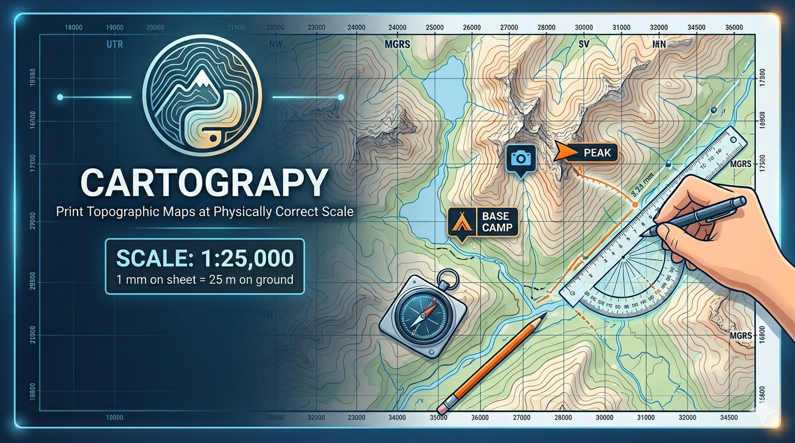
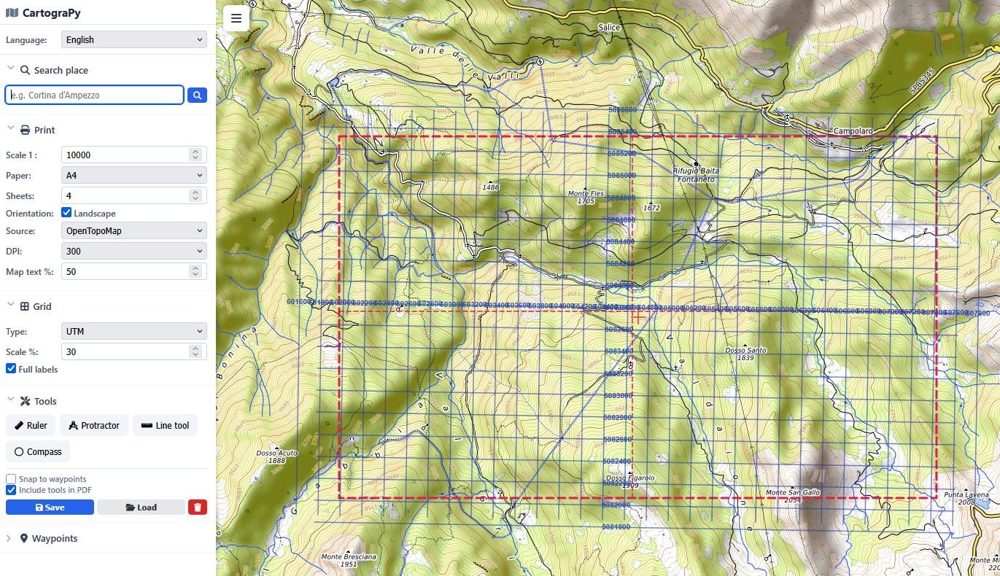
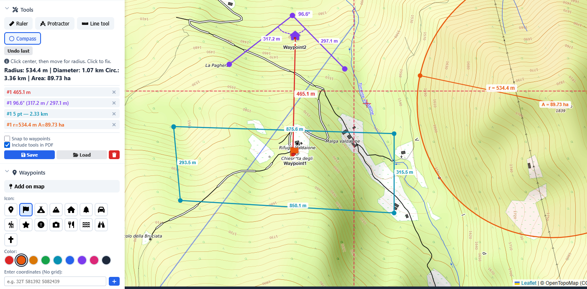

# CartograPy



Print topographic maps at physically correct scale — usable in the field with
compass, ruler, and UTM/MGRS coordinates.

## Why

Hikers, orienteers, and outdoor professionals need paper maps where 1 mm on the
sheet is exactly a known distance on the ground. CartograPy generates such maps
as PDF — with reference grid, waypoints, and measurement tools — printable at
100 % from any printer.



## Features

- **Physically correct scale** — 1:2 500 to 1:200 000 (or any custom value)
- **41 map sources** — 32 base maps + 9 overlays from OpenStreetMap, Esri, USGS,
  Swisstopo, IGN España, Kartverket, CartoDB, EMODnet/GEBCO, and more
- **19 grid systems** — UTM, MGRS, Lat/Lon, Gauss-Boaga, Swiss LV95, BNG, Dutch
  RD, Gauss-Krüger, Irish, EOV, KKJ, NZTM, SWEREF99, RT90, and others
- **Multi-sheet output** — 1–20 sheets with overlap markers and a position
  diagram, one PDF page per sheet
- **Waypoints** — click, type coordinates (UTM, MGRS, Lat/Lon DD/DM/DMS), bulk
  import; named sets stored as JSON
- **Measurement tools** — ruler, protractor, polyline, compass; live readings
  and rendered on the PDF
- **Smart search** — Photon autocomplete while typing, full Nominatim geocoding
  on Enter, last 10 searches persisted
- **Weather widget** — Open-Meteo hourly forecast; optional RainViewer radar
  and OpenWeatherMap overlays (free key)
- **Tile cache** — disk cache shared by web UI, tkinter GUI, and PDF exporter;
  XYZ and OGC WMS handled identically
- **Multi-language UI** — English, Italian, Chinese; add a language by dropping
  a JSON file into [cartograpy/static/lang/](cartograpy/static/lang)
- **Two interfaces** — Leaflet web app (default) and an alternative tkinter GUI



## Requirements

- Python ≥ 3.10 (with `tkinter`, normally bundled)
- Internet on first use; tiles are cached in `~/.cartograpy/tiles/`

## Quick start

```bash
git clone https://github.com/AeonDave/cartogra-py.git
cd cartogra-py
pip install -r requirements.txt
python run.py
```

The browser opens at `http://127.0.0.1:8271`. Press `Ctrl+C` to stop.

Optional, for the MGRS grid:

```bash
pip install mgrs
```

The alternative tkinter GUI:

```python
from cartograpy.app import CartograPyApp
CartograPyApp().mainloop()
```

## Workflow

1. Search for a place or pan/zoom the map
2. Set the **scale** (e.g. `10000` for 1:10 000)
3. Choose **paper size**, **orientation**, and **number of sheets**
4. The red dashed rectangle shows the print area; multi-sheet mode adds inner
   page boundaries
5. Pick a **grid system** — labels and lines update live
6. Add **waypoints** and use the **ruler / protractor / polyline / compass**
7. Click **Export PDF** and **print at 100 %** (no "fit to page")

> [!IMPORTANT]
> Printing with "fit to page" breaks the physical correspondence between paper
> and ground. Always print at actual size.

## Scale formula

```
1 mm on paper  =  scale / 1000  metres on the ground
```

At 1:10 000 and 300 DPI each pixel covers ≈ 0.85 m.

## Map sources

| Group | Sources |
|---|---|
| Global | OpenTopoMap, OpenStreetMap, CyclOSM, OSM DE, OSM France, OSM HOT, OPNVKarte |
| Esri | Streets, Topo, Satellite, NatGeo, Ocean Basemap |
| CartoDB | Positron, Voyager, Voyager NoLabels, Dark |
| Marine | EMODnet Bathymetry, GEBCO (WMS) |
| Regional | TopPlusOpen / BaseMap DE, Géoportail FR + Ortho, Swisstopo + Satellite, BasemapAT + Ortho, NL Kadaster, Kartverket Topo + Greyscale (NO), IGN España MTN, USGS Topo + Imagery |
| Overlays | Esri World Hillshade, OpenSeaMap Seamarks, OpenSnowMap Pistes, OpenRailwayMap, WaymarkedTrails Hiking · MTB · Cycling · Slopes · Riding |

WMS sources are proxied locally via `/api/tile/<source>/{z}/{x}/{y}.png` so they
share the same disk cache as XYZ tiles. Full list in
[cartograpy/tiles.py](cartograpy/tiles.py) (`TILE_SOURCES`).

## Grid systems

UTM · MGRS · Lat/Lon (auto DD / DM / DMS) · Gauss-Boaga (IT) · Swiss CH1903+ /
LV95 · British National Grid · Dutch RD New · German Gauss-Krüger · Irish Grid
+ ITM · Hungarian EOV · Finnish KKJ · NZTM · Swedish SWEREF 99 TM + RT90 ·
South African Lo29 · Taiwan TWD97 / TM2 · Qatar National Grid

## Configuration

CartograPy uses two separate JSON files:

| File | Purpose |
|---|---|
| `cartograpy-server.json` | Bootstrap: HTTP port, browser auto-open. Created beside `run.py` (or `CartograPy.exe`) on first launch. |
| `data/config.json` | Last-used UI state (scale, paper, source, position, language, search history…). Updated automatically. |

Saved waypoints and tool drawings live in `data/waypoints/*.json` and
`data/tools/*.json`.

## Windows executable

Build a portable launcher with tray icon and dedicated controller window:

```bash
pip install -r requirements-build.txt
python build_windows_exe.py
```

Outputs `dist/CartograPy/CartograPy.exe` plus the required `_internal/` folder.

Package the release archive (PowerShell):

```powershell
Compress-Archive -Path 'dist/CartograPy/*' -DestinationPath 'dist/CartograPy-windows-x64.zip'
```

The `.exe` alone is not enough — `_internal/` must travel with it.

To preview the launcher without building:

```bash
pip install -r requirements-build.txt
python -m cartograpy.launcher
```

## Adding a language

1. Copy [cartograpy/static/lang/en.json](cartograpy/static/lang/en.json) →
   `cartograpy/static/lang/<code>.json`
2. Translate the values; keep the keys
3. Add `<option value="<code>">Name</option>` to the language `<select>` in
   [cartograpy/static/index.html](cartograpy/static/index.html)

## Project layout

```
cartograpy/
  server.py        HTTP server + REST API (default interface)
  app.py           tkinter alternative GUI
  launcher.py      Desktop controller window for the Windows build
  tiles.py         TileCache + TILE_SOURCES (XYZ and WMS)
  grid.py          19 grid systems via pyproj
  geocoder.py      Nominatim + Photon clients
  export.py        PDF generator (true-scale)
  utils.py         Shared math and constants
  static/          Web UI: index.html, app.js, style.css, lang/
```

For an in-depth contributor guide see [AGENTS.md](AGENTS.md).

## License

Personal use. Map data © OpenStreetMap contributors (ODbL); other sources retain
their own licences (see attributions in the UI).
# CartograPy


Print topographic maps at physically correct scale — ready for real-world use
with compass, protractor, and UTM/MGRS coordinates in the field.

## Why

Hikers, orienteers, and outdoor professionals need paper maps where
1 mm on the sheet corresponds exactly to a known distance on the ground.
CartograPy generates those maps as PDF, complete with a reference grid,
waypoints, and measurement tools — all exportable and printable at 100 %.


## Features

- **Physically correct scale** — from 1:2 500 to 1:200 000; custom values supported
- **29 map sources** — OpenTopoMap, CyclOSM, Esri, Swisstopo, USGS, CartoDB, marine bathymetry (EMODnet, GEBCO) and more
- **19 grid systems** — UTM, MGRS, Lat/Lon, Gauss-Boaga, Swiss LV95, British National Grid, and others
- **Multi-sheet printing** — choose 1–20 sheets to cover a larger area; the PDF contains one page per sheet with overlap indicators and a position diagram
- **Waypoints** — place on map or enter coordinates (UTM, MGRS, Lat/Lon…), assign name/colour/icon, bulk import, save/load sets, snap-to-waypoint
- **Measurement tools** — ruler (distance), protractor (angle), polyline (cumulative distance), compass (radius); results displayed live and drawn on the PDF
- **Tool & waypoint files** — save and load sets of drawings and waypoints as named JSON files
- **PDF export** — paper formats A4, A3, A2, A1, Letter, Legal; portrait or landscape; 150–600 DPI; grid, waypoints and tools rendered on every page
- **Weather widget** — hourly forecast from Open-Meteo with clickable 24 h bar, temperature, precipitation, wind, humidity, cloud cover, and "Now" indicator
- **Map overlays** — multi-select panel for OpenSeaMap seamarks, Waymarked hiking trails, OpenRailwayMap, real-time radar (RainViewer, no key), and OpenWeatherMap precipitation/clouds/temperature/wind/pressure (free API key)
- **Multi-language UI** — English, Italian, Chinese; add new languages by dropping a JSON file
- **Tile cache** — downloaded tiles stored on disk; XYZ and WMS sources share the same cache; no repeated network requests
- **Smart search** — prefix autocomplete via Photon while typing; full geocoding via Nominatim on Enter; last 10 searches persisted across sessions


## Requirements

- Python ≥ 3.10 (with `tkinter` — usually included)
- Internet connection (tiles are fetched once and cached in `~/.cartograpy/tiles/`)

## Installation

```bash
git clone https://github.com/AeonDave/cartogra-py.git
cd cartogra-py
pip install -r requirements.txt
```

Optional — needed only for MGRS grid support:

```bash
pip install mgrs
```

## Usage

```bash
python run.py
```

Opens `http://127.0.0.1:8271` in the default browser. Press `Ctrl+C` to stop.

On first launch CartograPy also creates a dedicated server bootstrap config named
`cartograpy-server.json` beside `run.py`. You can edit that file to change the
listening port (or browser auto-open behaviour) before the next launch.

An alternative tkinter GUI is available via `cartograpy.app.CartograPyApp`.

## Dedicated server config

The web server bootstrap settings are intentionally separate from the UI config.

- `cartograpy-server.json` → startup settings for the local HTTP server
- `data/config.json` → last-used UI state inside the web app

When running from source, `cartograpy-server.json` is created in the project root.
When running from a packaged Windows build, it is created beside `CartograPy.exe`.

## Windows executable

For Windows users you can build a portable launcher that starts the local server
with a normal double-click:

Prerequisites:

- Windows
- Python 3.10+
- `pip`

```bash
pip install -r requirements-build.txt
python build_windows_exe.py
```

What the build script does:

1. Converts `img/logo.png` into a multi-size Windows icon at `build/generated/cartograpy.ico`
2. Bundles the launcher, web UI, logo, and Python runtime with PyInstaller
3. Writes the distributable app to `dist/CartograPy/`

The generated launcher is `dist/CartograPy/CartograPy.exe`.

It opens a small desktop controller window with:

- `Apri browser`
- `Apri config`
- `Apri cartella dati`
- `Ferma server`
- tray icon support to keep localhost alive in background

Main build outputs:

- `dist/CartograPy/CartograPy.exe` — runnable Windows launcher
- `dist/CartograPy/_internal/` — files required by the launcher bundle
- `build/generated/cartograpy.ico` — generated icon for the Windows executable

For a GitHub release, zip the whole `dist/CartograPy/` folder contents, not only the `.exe`.
The packaged app depends on `_internal/`, so shipping the executable alone is not enough.

To create the release archive from PowerShell:

```powershell
Compress-Archive -Path 'dist/CartograPy/*' -DestinationPath 'dist/CartograPy-windows-x64.zip'
```

Recommended release asset:

- `dist/CartograPy-windows-x64.zip`

On first start it creates these writable files beside the executable:

- `cartograpy-server.json`
- `data/config.json`
- `data/waypoints/*.json`
- `data/tools/*.json`

If you want a clean release package after local tests, delete any generated runtime files
inside `dist/CartograPy/` before creating the zip, especially:

- `dist/CartograPy/cartograpy-server.json`
- `dist/CartograPy/data/`

If you want to try the same controller without building the EXE first:

```bash
pip install -r requirements-build.txt
python -m cartograpy.launcher
```

## Workflow

1. Search for a place or pan/zoom the map
2. Set **scale** (e.g. `10000` for 1:10 000)
3. Choose **paper size**, **orientation**, and **number of sheets**
4. The red dashed rectangle shows the print area; with multiple sheets the inner dividers show each page boundary
5. Select a **grid system** (UTM, MGRS, …) — lines and labels update live on the map
6. Add **waypoints** by clicking the map, entering coordinates, or bulk-importing a list
7. Use the **ruler**, **protractor**, **polyline**, or **compass** tools to measure and annotate
8. Click **Export PDF**
9. Print at **100 %** — do not use "fit to page"

> [!IMPORTANT]
> The PDF must be printed at actual size (100 %). Scaling to fit the page
> breaks the physical correspondence between paper and ground distances.

## Scale formula

```
1 mm on paper  =  scale / 1000  metres on the ground
```

At 1:10 000 and 300 DPI each pixel covers ≈ 0.85 m.

## Map sources

41 tile sources (32 base maps + 9 overlays) grouped by category:

| Group | Sources |
|---|---|
| Global | OpenTopoMap, OpenStreetMap, CyclOSM, OSM DE, OSM France, OSM HOT, OPNVKarte |
| Esri | Streets, Topo, Satellite, NatGeo World Map, Ocean Basemap |
| CartoDB | Positron, Voyager, Voyager NoLabels, Dark |
| Marine | EMODnet Bathymetry, GEBCO (WMS) |
| Regional | TopPlusOpen (DE), BaseMap DE, Géoportail (FR), Géoportail Ortho, Swisstopo, Swisstopo Satellite, BasemapAT, BasemapAT Ortho, NL Kadaster, Kartverket Topo (NO), Kartverket Topo Greyscale (NO), IGN España MTN, USGS Topo, USGS Imagery |
| Overlays | Esri World Hillshade, OpenSeaMap Seamarks, OpenSnowMap Pistes, OpenRailwayMap, WaymarkedTrails Hiking / MTB / Cycling / Slopes / Riding |

Both XYZ and OGC WMS sources are supported. WMS sources are fetched server-side
through a local tile proxy (`/api/tile/<source>/{z}/{x}/{y}.png`) so they share
the same on-disk cache as XYZ tiles and the PDF exporter.

Full list in `TILE_SOURCES` inside [cartograpy/tiles.py](cartograpy/tiles.py).

## Grid systems

UTM · MGRS · Lat/Lon (auto DD / DM / DMS) · Gauss-Boaga (IT) · Swiss CH1903+ / LV95 · British National Grid · Dutch RD New · German Gauss-Krüger · Irish Grid · Irish TM · Hungarian EOV · Finnish KKJ · New Zealand TM · Swedish SWEREF 99 TM · Swedish RT90 · South African Lo29 · Taiwan TWD97 / TM2 · Qatar National Grid

## Adding a language

1. Copy `cartograpy/static/lang/en.json` → `cartograpy/static/lang/<code>.json`
2. Translate the values (keys stay the same)
3. Add `<option value="<code>">Name</option>` to the language `<select>` in `index.html`

## License

Personal use. Map data © OpenStreetMap contributors (ODbL).
